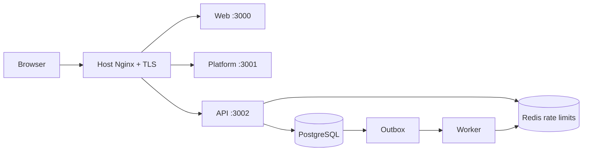

# AI Agent

Production-oriented monorepo for a public Next.js web application, a Vite
operations platform, and a NestJS API/worker pair backed by PostgreSQL, Redis,
Better Auth, BullMQ, and a transactional outbox.



Only Nginx is public. Container ports bind to loopback, PostgreSQL/Redis stay on
Docker networks, and the worker has no HTTP listener. Staging and production
are separate AWS Lightsail instances with independent state.

## Local development

Requirements: Node 24, pnpm 10.29.3, Docker Compose, and values for the required
names in `apps/backend/.env.example`.

```sh
pnpm install
pnpm db:up
pnpm db:deploy
pnpm dev:backend       # API
pnpm dev:worker        # second terminal
pnpm dev:web           # public site
pnpm dev:platform      # operations UI
```

Run `pnpm typecheck`, `pnpm lint`, and `pnpm test` before pushing. Backend E2E
uses the isolated Compose test profile and real PostgreSQL/Redis.

## Documentation

- [Architecture](docs/architecture.md)
- [Backend](docs/backend.md) and [frontend](docs/frontend.md)
- [Authentication and RBAC](docs/authentication-rbac.md)
- [Database](docs/database.md) and [Redis/queue/outbox](docs/redis-queue-outbox.md)
- [Networking and real IP](docs/networking-real-ip.md), [rate limiting](docs/rate-limiting.md), and [GeoIP](docs/geoip-session-location.md)
- [Docker Compose](docs/docker-compose.md), [Lightsail](docs/lightsail.md), and [Nginx/TLS](docs/nginx-tls.md)
- [CI](docs/ci.md), [CD](docs/cd.md), [deployment](docs/deployment.md), and [rollback](docs/rollback.md)
- [Backup/restore](docs/backup-restore.md), [security](docs/security.md), [operations](docs/operations-runbook.md), and [troubleshooting](docs/troubleshooting.md)
- [Project history](docs/project-history.md)

Production provisioning is operator-owned. The repository contains scripts and
runbooks, but live DNS, VPS secrets, TLS issuance, Environment configuration,
offsite backup, and restore drills remain pending until real infrastructure is
available.
