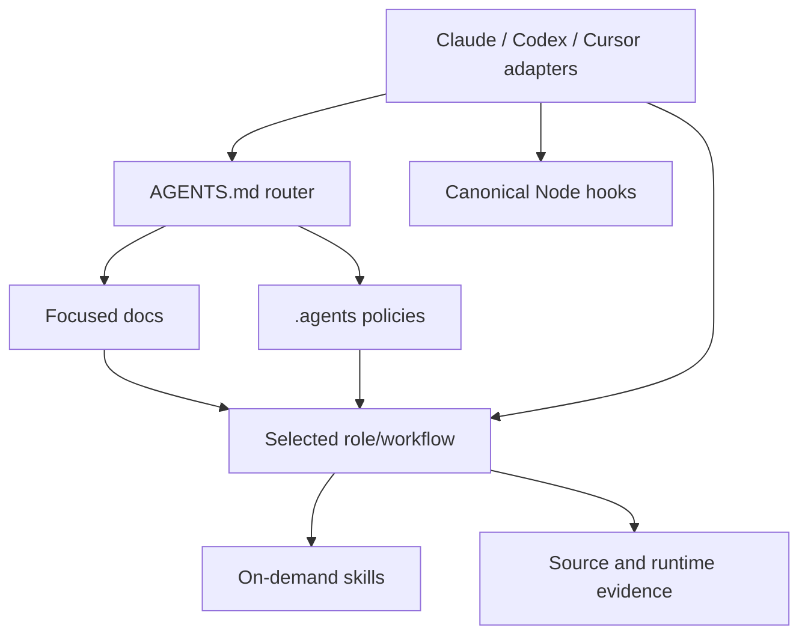

# Agent harness architecture

The repository uses one tool-neutral semantic layer under `.agents/` and thin
discovery adapters for OpenAI Codex, Claude Code, and Cursor.

## Ownership

- `AGENTS.md` is concise always-on orientation, invariants, validation, and
  authority boundaries.
- `docs/` is the human/agent system record for product and architecture.
- `.agents/policies/` owns detailed persistent invariants.
- `.agents/roles/` owns specialized responsibility contracts.
- `.agents/workflows/` owns explicit task graphs and bounded loops.
- `.agents/skills/` owns reusable procedures.
- `.agents/hooks/` owns deterministic enforcement logic.

Tool adapters may declare a tool's discovery schema, permissions, or event
mapping. Their prompt bodies only route to canonical files. The validation
command rejects missing references, duplicated skills, stale adapters, broken
links, unsafe hook definitions, and contradictory deployment-state claims.

## Tool mapping

| Concept | Codex | Claude Code | Cursor |
|---|---|---|---|
| Project guidance | Native `AGENTS.md` discovery | `CLAUDE.md` imports `AGENTS.md` | Native `AGENTS.md` discovery |
| Skills | Native `.agents/skills` | `.claude/skills/<name>` symlink | Native `.agents/skills` |
| Custom roles | `.codex/agents/*.toml` adapter | `.claude/agents/*.md` adapter | `.cursor/agents/*.md` adapter |
| Hooks | `.codex/hooks.json` | `.claude/settings.json` | `.cursor/hooks.json` |
| Reusable commands | Portable skills | Portable skills | Portable skills; no parallel command tree |

## Context discipline

Load context in this order: small router, focused docs, selected role/workflow,
relevant skills, then source/runtime evidence. Do not eagerly inject the entire
knowledge base or every policy into each tool prompt.

## Maintenance

Change canonical semantics first, update only adapters affected by schema, run
the harness validation command once introduced by the validation layer, and
update this document when ownership or discovery changes. Official tool
documentation must be rechecked before adopting a new adapter field or
lifecycle event.
