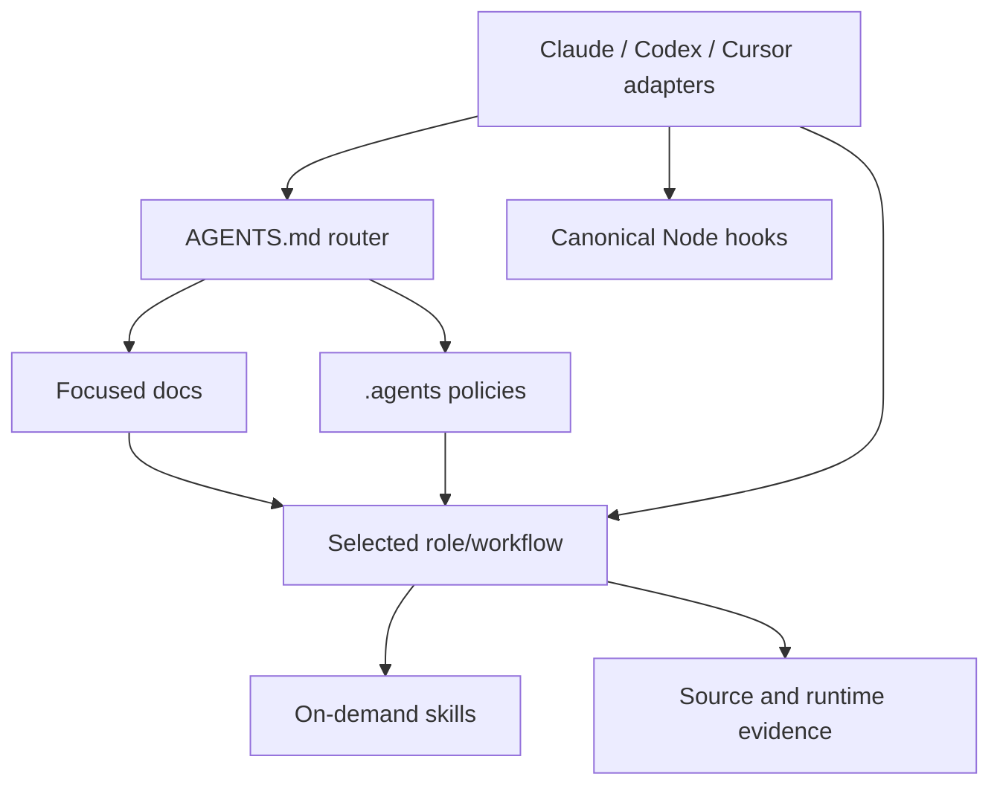

# Agent harness architecture

The repository uses one tool-neutral semantic layer under `.agents/` and thin
discovery adapters for OpenAI Codex, Claude Code, and Cursor.

## Ownership

- `AGENTS.md` is concise always-on orientation, invariants, validation, and
  authority boundaries.
- `docs/` is the human/agent system record for product and architecture.
- `.agents/policies/` owns detailed persistent invariants.
- `.agents/roles/` owns specialized responsibility contracts.
- `.agents/workflows/` owns explicit task graphs and bounded loops.
- `.agents/skills/` owns reusable procedures.
- `.agents/hooks/` owns deterministic enforcement logic.
- `.agents/scripts/` owns harness validation and the PR-train state model.

Tool adapters may declare a tool's discovery schema, permissions, or event
mapping. Their prompt bodies only route to canonical files. The validation
command rejects missing references, duplicated skills, stale adapters, broken
links, unsafe hook definitions, and contradictory deployment-state claims.

## Tool mapping

| Concept | Codex | Claude Code | Cursor |
|---|---|---|---|
| Project guidance | Native `AGENTS.md` discovery | `CLAUDE.md` imports `AGENTS.md` | Native `AGENTS.md` discovery |
| Skills | Native `.agents/skills` | `.claude/skills/<name>` symlink | Native `.agents/skills` |
| Custom roles | `.codex/agents/*.toml` adapter | `.claude/agents/*.md` adapter | `.cursor/agents/*.md` adapter |
| Hooks | `.codex/hooks.json` | `.claude/settings.json` | `.cursor/hooks.json` |
| Reusable commands | Portable skills | Portable skills | Portable skills; no parallel command tree |

Claude's skill adapters are symlinks, not generated copies. WSL/Linux
checkouts normally preserve them. Native Windows contributors must enable Git
symlink checkout on a symlink-capable filesystem before checkout; a regular
file containing the link target is invalid and is rejected by harness
validation. See [the adapter contract](../.agents/README.md#symlink-checkout-contract).

## Session state and resume

A session may produce several independently reviewable pull requests as a
bounded PR train: 3 open implementation PRs by default, 4 supported, and no
fourth started automatically at the default. The contract — schema, states,
dependency rules, checkpoint triggers, and forbidden actions — is
[the PR train workflow](../.agents/workflows/pr-train.md). It is stated once
there; this document only records where it lives and how it is split.

The split matters for testability. `.agents/scripts/pr-train.mjs` is pure: it
takes the dashboard text plus an evidence object and returns a model and
findings, with no filesystem, subprocess, or network access. That is what makes
the state machine and the reconciliation rules testable without a real
repository, and `.agents/scripts/__tests__/pr-train.test.mjs` exercises them
directly, including mutation probes that remove the train-limit guard and the
base/dependency agreement check and assert a test then fails.
`.agents/scripts/resume-task.mjs` is the integration boundary behind
`pnpm agents:resume`: it collects Git and GitHub evidence, hands it to the model,
and prints. It is read-only by construction.

`TODO.md` is a local operational dashboard, deliberately untracked. It never
overrules Git or GitHub, and it is not a substitute for a tracked exec plan under
`docs/exec-plans/`. Resume refuses outright if that file is tracked by Git, and
warns if it is merely unignored.

A compaction is treated as a process restart. Resume reconstructs state from
evidence and reports drift rather than repairing it silently; a dashboard that
does not parse stops resume with an explicit error list instead of a guess.

## Context discipline

Load context in this order: small router, focused docs, selected role/workflow,
relevant skills, then source/runtime evidence. Do not eagerly inject the entire
knowledge base or every policy into each tool prompt.

## Maintenance

Change canonical semantics first, update only adapters affected by schema, run
`pnpm agents:check`, and
update this document when ownership or discovery changes. Official tool
documentation must be rechecked before adopting a new adapter field or
lifecycle event.
