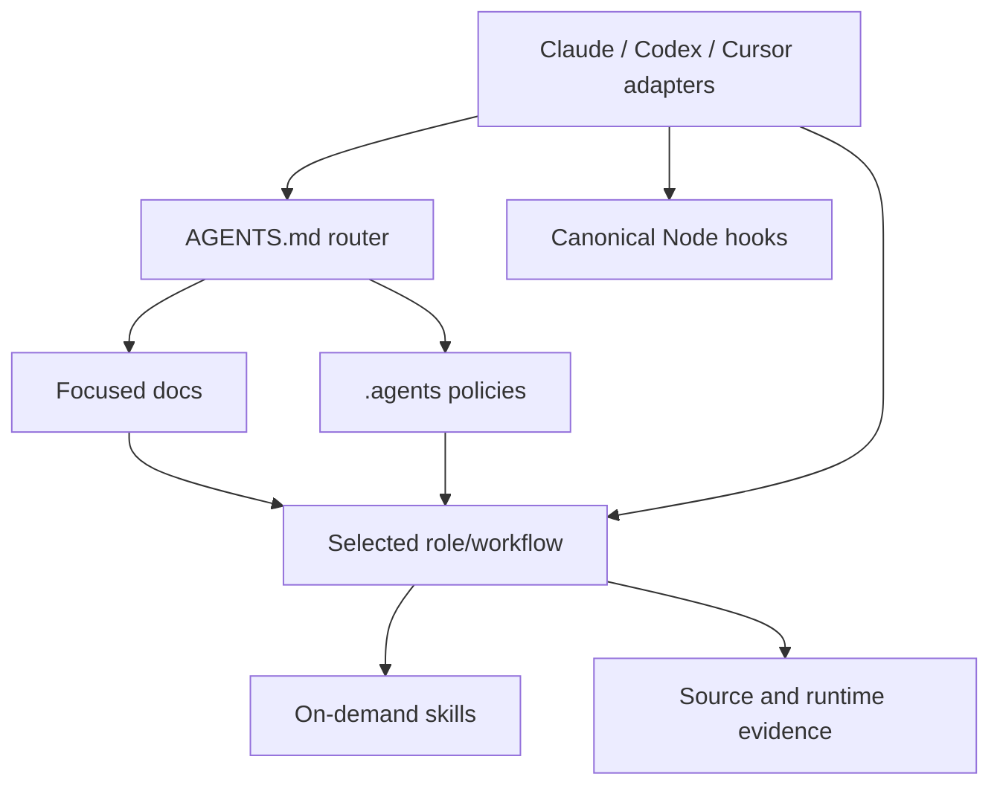

# Agent harness architecture

The repository uses one tool-neutral semantic layer under `.agents/` and thin
discovery adapters for OpenAI Codex, Claude Code, and Cursor.

## Ownership

- `AGENTS.md` is concise always-on orientation, invariants, validation, and
  authority boundaries.
- `docs/` is the human/agent system record for product and architecture.
- `.agents/policies/` owns detailed persistent invariants.
- `.agents/roles/` owns specialized responsibility contracts.
- `.agents/workflows/` owns explicit task graphs and bounded loops.
- `.agents/skills/` owns reusable procedures.
- `.agents/hooks/` owns deterministic enforcement logic.
- `.agents/scripts/` owns harness validation and the read-only resume snapshot.

Tool adapters may declare a tool's discovery schema, permissions, or event
mapping. Their prompt bodies only route to canonical files. The validation
command validates mechanical integrity only: present canonical files, adapter
routing and config shape, Node syntax, skill frontmatter, resolvable Markdown
links, and consistent deployment-state claims. It does not enforce a house style
for agent documents.

## Tool mapping

| Concept | Codex | Claude Code |
|---|---|---|
| Project guidance | Native `AGENTS.md` discovery | `CLAUDE.md` imports `AGENTS.md` |
| Skills | Native `.agents/skills` | `.claude/skills` path file to `.agents/skills` |
| Custom roles | `.codex/agents/*.toml` adapter | `.claude/agents/*.md` adapter |
| Hooks | `.codex/hooks.json` | `.claude/settings.json` |
| Reusable commands | Portable skills | Portable skills |

Claude Code references canonical skills via the `.claude/skills` path file pointing to `../.agents/skills`, with instructions configured in `CLAUDE.md`.

## Session state and resume

The repository owns no workflow state machine. Git, GitHub pull-request state,
and final-head CI are authoritative, and a resuming agent reads them directly.

`.agents/scripts/resume-task.mjs`, behind `pnpm agents:resume`, is a read-only
evidence reporter. It prints the repository root, branch, HEAD, `origin/main`,
upstream tracking, `git status --short --branch`, and recent decorated history;
then, when `gh` is available, the pull request for the current branch with its
state, base, head SHA, mergeability, check rollup for that exact head SHA, and
URL. It flags the case where the local HEAD differs from the PR head, because CI
for an older SHA says nothing about what is currently proposed.

It observes and never orchestrates: it runs inspection commands only, makes no
GitHub writes, mutates no files or refs, and needs no dashboard. When `gh` is
missing, unauthenticated, or the branch has no PR, it prints the local Git
evidence and says plainly that GitHub evidence is unavailable.

A compaction is a process restart, not continuity of memory. Everything the
snapshot prints therefore comes from evidence rather than from what an earlier
turn believed. An optional untracked `TODO.md` may hold a plain human-readable
note — goal, current branch, current PR, last completed step, known blocker,
next action. Nothing parses it, it is not validated, and it never overrules Git
or GitHub. Resume prints it verbatim if it exists.

Multi-PR sessions follow the rules in
[the Git and delivery policy](../.agents/policies/git-and-delivery.md): base on
`main` by default, stack only for a real dependency, keep each PR independently
reviewable, verify the final head, retarget children after the parent merges,
and leave merging to a human.

## Context discipline

Load context in this order: small router, focused docs, selected role/workflow,
relevant skills, then source/runtime evidence. Do not eagerly inject the entire
knowledge base or every policy into each tool prompt.

## Maintenance

Change canonical semantics first, update only adapters affected by schema, run
`pnpm agents:check`, and update this document when ownership or discovery
changes. Official tool documentation must be rechecked before adopting a new
adapter field or lifecycle event.
