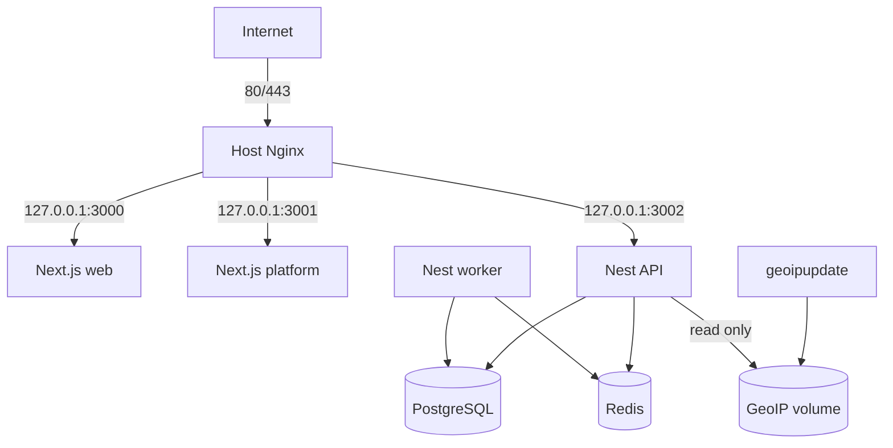
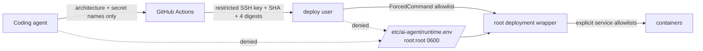
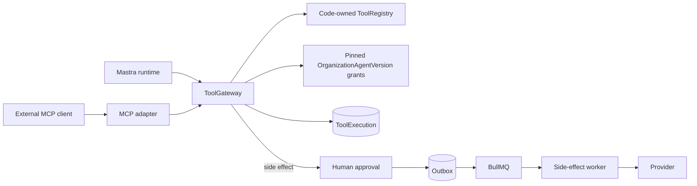

# Architecture

The system separates public ingress, application execution, durable state, and
ephemeral coordination. That separation is a security and failure-containment
boundary, not merely deployment layout.



The deployment control plane is intentionally narrower than the runtime data
plane:



Agent tool execution has one authority, and the runtimes and protocols around
it are adapters into it rather than peers of it:



Neither adapter holds authority. Each receives only the bound closures the
gateway returns for one accepted run, so neither can name an organization,
widen a grant, or reach a provider.

## Backend source boundaries

The backend is organized around responsibility rather than framework type. The
target source topology is:

```text
apps/backend/src/
├── core/             generic application-independent primitives
├── infrastructure/   technical adapters and application infrastructure
├── ai/               the generic internal AI platform
├── features/         product and business capabilities
├── workers/          worker-process composition and job handlers
├── api/              the HTTP API composition root
├── cli/              operator-command composition
├── generated/        generated artifacts such as the Prisma client
└── i18n/             translation resources
```

This structure is intended to make rapid product experimentation safe: a new
business capability has an obvious home and can use stable technical and AI
machinery without turning that machinery into a product-specific dependency.
It is not an attempt to build a reusable framework, introduce speculative
packages, or abstract every dependency behind an interface.

The boundaries have the following responsibilities:

- `core` stays deliberately small. It owns only genuinely generic errors,
  types, and small utilities. Where practical it has no dependency on NestJS,
  Prisma, BullMQ, Redis, Mastra, Better Auth, or any composition root or
  product feature.
- `infrastructure` owns technical application concerns: configuration,
  authentication, Prisma/database access, HTTP middleware and contracts,
  documentation, logging and observability, Redis, BullMQ transport, outbox,
  mail, i18n integration, GeoIP, rate limiting, health, lifecycle, and
  technical providers. It does not own business capabilities.
- `ai` owns the generic internal AI platform: agent contracts and registries,
  context and run execution, reconciliation, tool definitions and execution,
  model catalog, and runtime adapters such as Mastra. Product-specific agent
  behavior remains with its owning feature.
- `features` owns business capabilities such as content, knowledge,
  organizations, the control plane, and agent management. Feature controllers
  stay with the feature; `api` is not a controller bucket.
- `workers` owns what the worker process executes: its entrypoint, composition
  module, handler registry, job handlers, and worker-only background services.
  Generic BullMQ and Redis transport remains in `infrastructure`.
- `api` owns only the Nest HTTP composition root and entrypoint. `cli` owns the
  operator-command entrypoint and command composition. These roots may depend
  inward on features, AI, and infrastructure; those layers do not depend back
  on the roots.
- `generated` remains generated and is not moved merely for symmetry. `i18n`
  remains the source translation tree consumed by the i18n infrastructure.

The intended dependency direction is toward generic policy and technical
mechanisms, never toward process composition:

```text
api / workers / cli  ──►  features  ──►  ai (when needed)
        │                    │               │
        └────────────────────┴───────────────┴──► infrastructure
                                                     │
                                                     └──► core
```

This is a responsibility guide, not permission for cycles. In particular,
`core` does not import `infrastructure`, `ai`, or `features`;
`infrastructure` does not import product features; and generic `ai` code does
not import feature internals. A feature may own a product-specific agent
definition while depending on generic contracts from `ai`.

These source-level directions are enforced by scoped `no-restricted-imports`
rules in `apps/backend/eslint.config.mjs`. Composition roots remain free to wire
the layers together; lower layers cannot import those roots.

Backend tests mirror the boundary they exercise rather than where they happen
to be authored:

```text
apps/backend/test/
├── unit/          isolated core, infrastructure, AI, feature, and worker tests
├── integration/   collaborations with technical or application boundaries
├── e2e/           process-level API, AI, and feature behavior
└── support/       shared test harnesses and fixtures
```

Only populated categories are created. Moving a test must not change its
assertions or convert an integration contract into a mock-heavy unit test.

Structural changes follow a narrow rule: move files with history, correct
imports and module paths, remove obsolete exports, and keep every intermediate
revision buildable. They preserve behavior, API and database contracts,
authorization and tenant semantics, durable execution guarantees, and the
separate API and worker roots. This restructuring does not replace Prisma,
NestJS, BullMQ, or Mastra; rename Tool to Capability; generalize AgentRun;
redesign schemas or authorization; add Cloudflare, Temporal, or Restate
execution; create speculative workspace packages; or add unrelated product
features.

## Invariants

- PostgreSQL is authoritative. Redis is coordination and may be lost without
  losing accepted business work.
- API and worker use the same backend image but separate composition roots and
  commands. Migrations are a one-shot image mode, never container startup work.
- The API transaction commits a business row and outbox event together. Worker
  delivery is at-least-once, so handlers require durable idempotency.
- Nginx is the only trusted proxy. Exactly one proxy hop is trusted in staging
  and production; local/test trust zero.
- Staging is live. The target Production environment will share artifacts with
  Staging but not databases, Redis, volumes, runtime.env, deploy keys, or hosts.
- Prepared Production workflows and scripts are architecture, not evidence of
  a provisioned Production environment.
- GitHub may know architecture and secret names. It never receives VPS runtime
  application secret values.
- The deploy identity cannot read `runtime.env`, use Docker directly, or run an
  arbitrary shell. The root wrapper validates the file and passes only each
  process's allowlisted settings to Compose.
- `ToolGateway` is the only authority over what an agent may do. A runtime or
  protocol adapter receives bound closures for one accepted run and never the
  gateway, the registry, grant state, or a tenant id. Adding an adapter must
  never add a second registry, grant model, `ToolExecution` writer, or approval
  path.
- An external side effect is proposed by a model and performed by nobody until
  an authorized person decides. The API may execute read-only and proposing
  tool calls in-process; only the worker performs the effect.

See the focused documents for enforcement and failure behavior.
