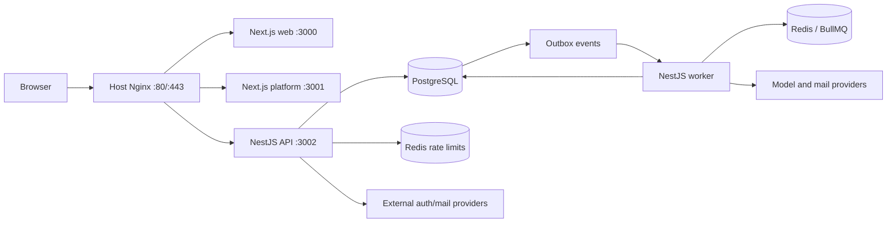

# Architecture

The system separates public ingress, interactive applications, asynchronous
execution, durable state, and transport coordination.



Only Nginx accepts public traffic. Application ports bind to loopback on the
host; PostgreSQL and Redis remain on private Docker networks. The worker has no
HTTP listener.

## Application boundaries

- `apps/web` serves the public localized site.
- `apps/platform` serves authenticated account, organization, content, and
  platform-administration screens under `/platform`.
- `apps/backend` has separate API, worker, and CLI composition roots. The API
  accepts requests and commits state. The worker dispatches the outbox and
  consumes BullMQ jobs. The CLI performs host-authorized operator actions.
- `packages/ui` and `packages/i18n-core` contain shared presentation and
  locale contracts. `packages/authz-policy` declares the authorization policy
  the backend and the platform both answer from. None of them executes
  business behavior: enforcement stays in the backend.

The backend source dependency direction is:

```text
core <- ai <- features
  ^      ^       ^
  +-- infrastructure --+
```

`core` contains application-independent primitives. `ai` owns agent,
runtime, model, and tool contracts without product-specific knowledge.
`features` owns organization capabilities. `infrastructure` supplies
technical adapters and is assembled only at composition roots.

## Durable invariants

- PostgreSQL is authoritative for accepted work and business lifecycle. Redis
  may be rebuilt without losing accepted work.
- An API transaction writes the business record and its outbox event together.
  Queue delivery is at least once, so handlers use PostgreSQL constraints and
  conditional writes for idempotency.
- Agent runs pin their code-owned definition, organization-owned configuration,
  model policy, model, and pricing revision when accepted.
- Organization-owned rows carry organization identity through their durable
  relationships. Authorization uses the organization in the request path, not
  a session's selected organization.
- Platform roles and organization roles are separate. Browser gates never
  replace backend authorization.
- API, worker, and migration modes are separate. Migrations are deployment
  gates, not application startup work.
- Provider inputs and outputs are parsed at application boundaries. Raw
  provider errors, prompts, credentials, and responses are not persisted as
  run diagnostics.
- Releases are immutable image sets. The host checks release identity and
  minimum host-bundle compatibility before migration or replacement.

Implementation detail belongs in [backend](backend.md), [database](database.md),
[queue/outbox](redis-queue-outbox.md), [authentication and RBAC](authentication-rbac.md),
and [security](security.md). Current environment state belongs only in
[deployment state](deployment-state.md).
