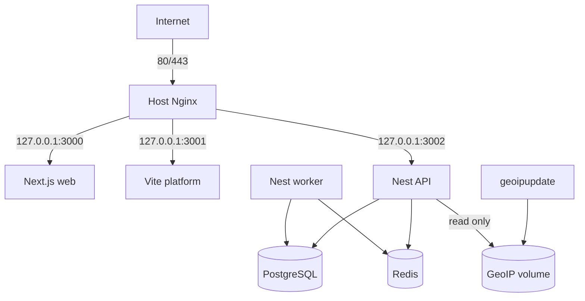
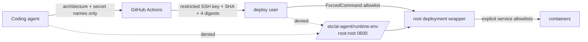
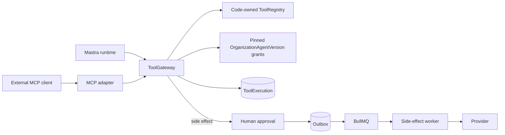

# Architecture

The system separates public ingress, application execution, durable state, and
ephemeral coordination. That separation is a security and failure-containment
boundary, not merely deployment layout.

The deployment control plane is intentionally narrower than the runtime data
plane:

Agent tool execution has one authority, and the runtimes and protocols around
it are adapters into it rather than peers of it:

Neither adapter holds authority. Each receives only the bound closures the
gateway returns for one accepted run, so neither can name an organization,
widen a grant, or reach a provider.

## Invariants

- PostgreSQL is authoritative. Redis is coordination and may be lost without
  losing accepted business work.
- API and worker use the same backend image but separate composition roots and
  commands. Migrations are a one-shot image mode, never container startup work.
- The API transaction commits a business row and outbox event together. Worker
  delivery is at-least-once, so handlers require durable idempotency.
- Nginx is the only trusted proxy. Exactly one proxy hop is trusted in staging
  and production; local/test trust zero.
- Staging is live. The target Production environment will share artifacts with
  Staging but not databases, Redis, volumes, runtime.env, deploy keys, or hosts.
- Prepared Production workflows and scripts are architecture, not evidence of
  a provisioned Production environment.
- GitHub may know architecture and secret names. It never receives VPS runtime
  application secret values.
- The deploy identity cannot read `runtime.env`, use Docker directly, or run an
  arbitrary shell. The root wrapper validates the file and passes only each
  process's allowlisted settings to Compose.
- `ToolGateway` is the only authority over what an agent may do. A runtime or
  protocol adapter receives bound closures for one accepted run and never the
  gateway, the registry, grant state, or a tenant id. Adding an adapter must
  never add a second registry, grant model, `ToolExecution` writer, or approval
  path.
- An external side effect is proposed by a model and performed by nobody until
  an authorized person decides. The API may execute read-only and proposing
  tool calls in-process; only the worker performs the effect.

See the focused documents for enforcement and failure behavior.
