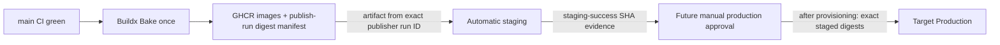

# Continuous delivery

Staging is live; Production is not provisioned. The publisher runs only after
a successful push-to-main CI run. Its trusted
source SHA comes from that CI event, and it emits backend, migration, web, and
platform SHA tags with provenance/SBOM. Deployment identity is the four
resolved OCI digests recorded with repository, CI run ID, and publisher run ID;
neither `latest` nor a mutable SHA tag is accepted by the host.

Staging downloads artifacts from exactly its triggering publisher run ID,
validates the embedded lineage and fixed GHCR repositories, deploys the four
digests, and emits `staging-success-<SHA>` evidence containing its own run ID.
It does not trust a nested `workflow_run.head_sha`. Production is
workflow-dispatch only from `main`; it locates successful staging-run evidence
for the requested SHA, verifies that artifact's embedded run ID, and promotes
the exact four staged digests. Neither workflow rebuilds source or receives
runtime application secrets. The Production workflow and evidence validation
are prepared but dormant future capability; agents must not dispatch it.

Every release also declares which host it needs. The publisher exports
`ops/host-bundle/MIN_VERSION` into Bake, which labels each image with the
release SHA and that minimum, and records the same minimum in the digest
manifest as `hostBundleMinVersion`; both deploy workflows refuse a manifest
without it. The host reads the labels after pulling and before migrating and
refuses a release its recorded bundle cannot satisfy — see
[the host bundle document](host-bundle.md).

After a deployment is healthy and its `CURRENT`/`PREVIOUS` state has rotated, the
wrapper reclaims the superseded release's images on its own deployment lock. That
step never fails a deployment that has already succeeded, and it reports its
outcome either way; the hard disk gate remains the next deployment's preflight.
See [release image retention](release-retention.md).

The digest manifest and the staging evidence both travel as GitHub Actions
artifacts, uploaded with `actions/upload-artifact@v7` and read back with
`actions/download-artifact@v8` — the current majors, both on the Node 24
runtime. Two packaging defaults are part of the contract rather than incidental.
Uploads stay archived: an unzipped direct upload ignores the artifact name and
derives it from the filename, which would rename both artifacts and leave the
production promotion gate unable to find its evidence. Downloads keep
`digest-mismatch` at its fail-closed default, so a manifest whose hash does not
match the server stops the deployment instead of configuring one.
`ops/tests/artifact-contract.sh` asserts the whole handoff statically, because
the cross-run download cannot be exercised from a pull request.

Both workflows use non-cancelling environment concurrency, pinned SSH host keys,
the `deploy` identity, migration-first rollout, internal health, and external
HTTPS smoke tests. Configure production Environment reviewers and main-only
deployment policy.
