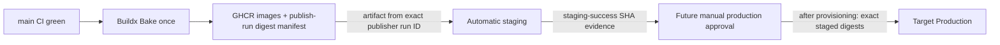

# Continuous delivery

Staging is live; Production is not provisioned. The publisher runs only after
a successful push-to-main CI run. Its trusted
source SHA comes from that CI event, and it emits backend, migration, web, and
platform SHA tags with provenance/SBOM. Deployment identity is the four
resolved OCI digests recorded with repository, CI run ID, and publisher run ID;
neither `latest` nor a mutable SHA tag is accepted by the host.

Staging downloads artifacts from exactly its triggering publisher run ID,
validates the embedded lineage and fixed GHCR repositories, deploys the four
digests, and emits `staging-success-<SHA>` evidence containing its own run ID.
It does not trust a nested `workflow_run.head_sha`. Production is
workflow-dispatch only from `main`; it locates successful staging-run evidence
for the requested SHA, verifies that artifact's embedded run ID, and promotes
the exact four staged digests. Neither workflow rebuilds source or receives
runtime application secrets. The Production workflow and evidence validation
are prepared but dormant future capability; agents must not dispatch it.

Both workflows use non-cancelling environment concurrency, pinned SSH host keys,
the `deploy` identity, migration-first rollout, internal health, and external
HTTPS smoke tests. Configure production Environment reviewers and main-only
deployment policy.
