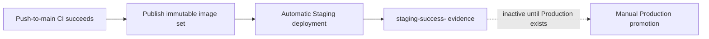

# Continuous delivery

Staging is live; Production is not provisioned. The publisher runs only from a
successful push-to-`main` CI result and builds backend, migration, web, and
platform images once. It records their OCI digests, source SHA, originating CI
run, publisher run, and minimum host-bundle version in
`image-digests.json`. Images include provenance and SBOM attestations.

Staging downloads the manifest from its exact triggering publisher run,
validates lineage and fixed GHCR repositories, deploys the four digests, then
uploads `staging-success-<SHA>` with its own run ID. It does not rebuild or
accept mutable application tags.

The inactive Production workflow accepts a requested SHA only, finds successful
Staging evidence for it, verifies the embedded run ID, and would promote the
same digests without rebuilding. It must not be dispatched while Production is
unprovisioned.

Artifacts use `actions/upload-artifact@v7` and
`actions/download-artifact@v8`. Uploads retain archive packaging so the
explicit artifact name is preserved; downloads retain digest verification.
`infra/tests/artifact-contract.sh` verifies this cross-workflow handoff
statically.

Every image carries `io.ai-agent.release.sha` and
`io.ai-agent.host-bundle.min-version`. The host checks the release set,
installed bundle, disk, runtime configuration, Compose resolution, and database
capabilities before migrations. See [host bundle](host-bundle.md).

Both deployment workflows use non-cancelling environment concurrency, pinned
SSH host keys, the restricted `deploy` identity, migration-first rollout,
internal health checks, and public HTTPS smoke tests. After a successful deploy
and release-state rotation, image retention runs on the deployment lock and
never fails the deployment; see [release retention](release-retention.md).
