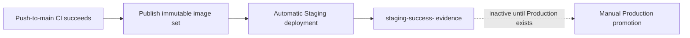

# Continuous delivery

Staging is live; Production is not provisioned. The publisher runs only from a
successful push-to-`main` CI result and builds the components in
[`infra/release/components`](../infra/release/components) once — today backend,
backend-migration, web, and platform. It records them as a `schemaVersion: 3`
component manifest in `image-digests.json`: each entry carries the component
name, its GHCR repository, its immutable OCI digest, the commit it was built
from, whether a deployment may proceed without it, and the host bundle it needs.
The release states its source SHA, originating CI run, publisher run, and
minimum host-bundle version alongside. Images include provenance and SBOM
attestations, and each carries an `io.ai-agent.component.name` label.

`schemaVersion: 2` — the flat four-field manifest every release published
before this — is still accepted. Both deployments read it through
[`infra/release/manifest.jq`](../infra/release/manifest.jq), which normalises
either format to the same component list before validating any of it, so
nothing downstream knows which arrived. The version 2 `migration` field becomes
the `backend-migration` component and the alias ends there.

A component the catalog does not name, a repository outside the release
namespace, a duplicate, a malformed digest or source SHA, a missing required
component, or a component built from a different commit than the release is a
refusal. Mixed-version releases are describable by the schema and are not
deployable: every component must carry the release commit.

Staging downloads the manifest from its exact triggering publisher run,
validates lineage and fixed GHCR repositories, deploys the component digests, then
uploads `staging-success-<SHA>` with its own run ID. It does not rebuild or
accept mutable application tags.

The inactive Production workflow accepts a requested SHA only, finds successful
Staging evidence for it, verifies the embedded run ID, and would promote the
same digests without rebuilding. It must not be dispatched while Production is
unprovisioned.

Artifacts use `actions/upload-artifact@v7` and
`actions/download-artifact@v8`. Uploads retain archive packaging so the
explicit artifact name is preserved; downloads retain digest verification.
`infra/tests/artifact-contract.sh` verifies this cross-workflow handoff
statically.

Every image carries `io.ai-agent.release.sha` and
`io.ai-agent.host-bundle.min-version`. The host checks the release set,
installed bundle, disk, runtime configuration, Compose resolution, and database
capabilities before migrations. See [host bundle](host-bundle.md).

Both deployment workflows use non-cancelling environment concurrency, pinned
SSH host keys, the restricted `deploy` identity, migration-first rollout,
internal health checks, and public HTTPS smoke tests. After a successful deploy
and release-state rotation, image retention runs on the deployment lock and
never fails the deployment; see [release retention](release-retention.md).
