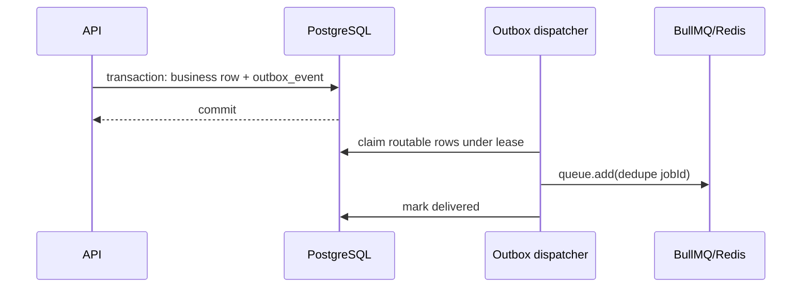

# Redis, queue, and outbox

Redis holds coordination state: BullMQ, sliding-window rate limits, probes, and
future short-lived coordination. Production enables AOF with `noeviction`, but
Redis is never the system of record.

Connections are provisioned by role. Request-facing/general commands have
bounded timeouts, finite retries, and no offline queue. Queue producers return
after bounded failure so outbox work remains claimable. Worker blocking
connections retry indefinitely as BullMQ requires.

A crash between publish and mark-delivered produces a duplicate after lease
expiry. Consumers must therefore be idempotent through PostgreSQL constraints;
BullMQ job IDs are only an optimization. Unknown publish failures retry with
capped backoff, while deterministically invalid payloads are parked and kept.
Known gaps in the current application are outbox retention and exported backlog
metrics.

The internal AgentRun acceptance boundary follows that existing path: one
PostgreSQL transaction creates a `QUEUED` `agent_run` and an
`agent-run.queued` outbox event whose payload is only `{ runId }` and whose
dedupe key is that run id. Before inserting, acceptance resolves the enabled
active organization-agent version and stores its immutable id; configuration
and the resolved model-policy/model/price identities stay on `agent_run` and
never enter the outbox or queue. The existing route publishes `execute` to
`agent-execution`. `WorkerModule` registers the handlers —
`AgentExecutionHandler`, `KnowledgeEmbeddingHandler` and
`SideEffectExecutionHandler`; `QueueModule` contains publication only, so the
API composition root cannot consume jobs.

Knowledge ingestion uses the same boundary. One transaction writes the document
and its chunks and appends a `knowledge-document.ingested` event carrying only
`{ documentId, organizationId }`, which routes `embed` to `knowledge-embedding`.
The dedupe key is `${documentId}:${revision}` rather than the document id
alone: the key becomes BullMQ's job id, so keying on the document would let a
second edit be discarded as a repeat of the first while retention still held
it, leaving the new revision's chunks unembedded. Idempotency under redelivery
is PostgreSQL-backed rather than key-based — the handler embeds only chunks
that have no vector for the current model, so a duplicate delivery finds
nothing to do.

An approved side effect uses it a third time. Approving a proposal writes the
approval decision, moves the `tool_execution` row to `APPROVED`, appends a
`tool-execution.approved` event carrying only `{ toolExecutionId,
organizationId }` with the execution id as dedupe key, and writes the audit row
— one transaction, so "approved" and "queued to perform" cannot disagree. The
event routes `deliver` to `tool-side-effect`, a queue of its own because a
delivery is one short provider call with a strict idempotency contract rather
than a long model call. `SideEffectExecutionHandler` is the consumer, and it is
built for the redelivery this document promises: a terminal row is a no-op, a
non-approved row performs nothing, each attempt is claimed by compare-and-set on
`effectAttemptCount` so concurrent deliveries cannot both call the provider, and
the provider call carries a key derived from the execution id so a retry inside
the provider's 24-hour window replays rather than resends. When the transport's
attempts are exhausted on an ambiguous answer the row is settled
`OUTCOME_UNKNOWN`, not `FAILED`, and no later delivery sends. See
[the backend document](backend.md#human-approval-and-the-idempotent-side-effect).

One gap is stated rather than closed. A row can stay `APPROVED` with
`effectAttemptCount > 0` if the process dies after the provider call and
before the settlement is written, and the job then exhausts its stalled-job
allowance without the handler running again; or if the settlement write itself
rejects on the last attempt. No sweep re-derives those rows — unlike an agent
run, an `APPROVED` execution has no transport verdict that would make a
terminal state honest — so an operator finds them by status and age and
reconciles against the provider by the key `toolId@toolVersion:executionId`;
see [the operations runbook](operations-runbook.md).

The handler stores BullMQ's `attemptsStarted` active-start ordinal as the durable
AgentRun `attemptCount` compare-and-set version. Unlike `attemptsMade`, that
ordinal advances for stalled-job recovery as well as ordinary retries.

The claim is **monotonic, not exact-predecessor**: a delivery takes ownership
when `attemptCount < attemptsStarted`, and equal or lesser ordinals are stale
or duplicate and do nothing. This matters because BullMQ increments
`attemptsStarted` in Redis at move-to-active, before application code runs, so
a worker killed between activation and its first write consumes an ordinal
PostgreSQL never sees. The durable sequence is strictly increasing but may have
gaps — after a claim at 1, the next delivery to arrive can legitimately be 3.
Requiring an exact predecessor would wedge that run permanently. The ordinal is
used as a fencing token, which is sound because BullMQ never reissues or
decrements it; completion and failure writes are still gated on the exact
`attemptCount` the caller claimed, so a superseded worker cannot finalize a run
another delivery now owns.

Terminal runs are no-ops. Retryable failures stay `RUNNING` and reject for
BullMQ retry; the configured final attempt records `FAILED` and also rejects so
BullMQ job state remains truthful. Outbox delivery, BullMQ job, and AgentRun
lifecycle states remain distinct.

The worker resolves the definition by the persisted `(agentId, agentVersion)`
pair, never by id alone. A definition is immutable once published under a
version, and any version still referenced by a `QUEUED` or `RUNNING` AgentRun
must stay resolvable through a rolling deployment. Unknown pairs fail loudly
rather than falling back to a newer revision. On every attempt it also reloads
the exact `organizationAgentVersionId` through tenant, agent, and definition-
revision predicates, parses that immutable configuration again, and passes the
application-owned value to the runtime. It also validates the run's pinned
policy, model, and acceptance-time price revision before passing the stable
model identity to the adapter. Retries therefore cannot drift to a new active
pointer or a newer policy/catalog default. Automated retention of superseded
versions is not implemented.

A process can call a model and die before recording `SUCCEEDED`; the later
attempt may call the model again. This is accepted for model calls and
read-only tools, not presented as exactly-once execution. The one external side
effect is different and is handled differently: it is never performed inside a
run, and its delivery is keyed so a repeat is a replay — see above.

## Terminal transport reconciliation

BullMQ can end a job without the handler ever running. If a job exceeds its
stalled-job allowance (`maxStalledCount`, default 1),
`moveStalledJobsToWait` writes a deferred-failure marker onto the job hash and
returns the job to `wait`; the next worker to fetch it converts that marker into
a synthetic `UnrecoverableError` and fails the job on a branch that skips the
processor. No application code runs, so nothing records the outcome and the
AgentRun would stay `RUNNING` forever.

`AgentRunReconciler` closes that. It runs in the worker process only, on its own
interval, and each pass:

1. reads a bounded page of the oldest `QUEUED`/`RUNNING` runs from PostgreSQL;
2. asks the transport for each one's job state — the job id is the run id, so no
   mapping is needed — except for MCP sessions, which are never asked about;
3. writes `FAILED` with `completedAt` and an application-owned constant for the
   ones whose job is in the failed set.

The write is conditional on the run still being non-terminal, so duplicate,
delayed, and reordered observations are no-ops. It does not match on
`attemptCount`: the sweep is not an attempt, and no ordinal it could forge would
be right.

That conditional protects a run that has already reached `SUCCEEDED`, and
deliberately not one that is still in flight. A worker whose lock lapsed while
its model call was running keeps running; BullMQ fails the job, the sweep
records `FAILED`, and the worker's later `markExecutionSucceeded` then matches
nothing and its result is discarded. That is a genuine lost result and it is the
accepted trade: the transport has given up on the job, and a row left `RUNNING`
forever is worse than one recorded as failed. It is also bounded by the
staleness threshold, which is why that threshold should stay comfortably above
the slowest expected model call.

Candidates are read oldest-first through a keyset cursor on
`(updatedAt, id)` rather than always from the beginning. A candidate the sweep
cannot act on is left unwritten, so its `updatedAt` never moves; without the
cursor those rows would be returned again on every pass, and once enough of them
existed to fill a page no newer run would ever be examined again — the recovery
mechanism would stop recovering with no signal but a repeated log line. The
cursor resets when a page comes back short, so the scan is a cycle. Losing it to
a restart costs a cycle, not correctness.

It advances only past a *finished* observation. For a job the transport reports
`pending` or `missing` that is the verdict itself, since there is nothing left
to do for the row; for a `failed` one it is the terminal write resolving. If
that write rejects, the pass propagates the rejection with the cursor still
behind the candidate, so the next pass is handed the same row. Advancing on the
verdict instead would let one PostgreSQL blip carry the scan past a run already
proven to need finalizing — and because nothing wrote it, its `updatedAt` would
not move and only a wrap could bring it back, which a backlog that keeps filling
pages need not produce.

**`QueueEvents` is deliberately not the mechanism.** Its consumer is a plain
`XREAD` starting at `$` with no cursor persisted anywhere — BullMQ 6.1.2 has no
consumer groups — so an event published while the process is down is lost rather
than delivered late; the stream is trimmed to roughly ten thousand entries; and
its listeners are not awaited, so an `async` listener that rejects becomes an
unhandled rejection. It remains what it already was: failure telemetry. The
sweep re-derives its candidates from PostgreSQL every pass, so correctness
survives a restart and depends on nothing held in memory. A pass that fails
because PostgreSQL or Redis was unreachable is logged and retried on the next
interval; it holds no lease and no claim, so an abandoned pass costs latency
only.

MCP sessions take the other branch, and it is not an exclusion. A session has
no job by design — acceptance appends no outbox event — so the transport would
answer `missing` for every session on every pass, and `missing` is deliberately
not a terminal verdict. Left to that path a session would sit `RUNNING` forever
while being logged as a stranded row indefinitely: a durable lie about a session
that ended, plus an unbounded stream of lines describing a static set. So the
pass finalizes a session whose absolute lifetime has run out and leaves a live
one strictly alone. Age is the only signal needed and it is sufficient, because
the lifetime is measured from acceptance rather than from activity. Closing is a
compare-and-set, so a client that closed first keeps its own outcome and the
pass counts nothing — the two disagree about `closedBy`, and a row whose history
contradicts itself is worse than an uncounted sweep.

Two things the reconciler deliberately does not do. It never re-queues: a fresh
job restarts `attemptsStarted` at 1 while the run still holds a higher
`attemptCount`, so the monotonic fence would reject the claim, the handler would
return normally, and BullMQ would record a completed job for work that never
ran. Re-running a failed run is a separate operation with its own semantics. And
it never fails a run for being slow — a run is finalized only on proof that the
transport is finished with its job. A job the transport has no record of is
reported and left alone, because absence proves nothing: retention removes a
failed job after a week, and a run accepted a moment ago has not been published
yet. Those runs are summarized once per pass rather than logged individually,
since they are by definition a set nothing will change.

Each pass issues at most `AGENT_RUN_RECONCILE_BATCH_SIZE` transport reads, and
each is a single bounded command rather than a scan of the failed set. The reads
are bounded in Redis round trips but not strictly in Redis work: BullMQ's job-
state script uses `LPOS` against the `active` and `wait` lists, so a job absent
from both costs a traversal proportional to their length. That is the case that
co-occurs with a large backlog, and it is why the interval is minutes rather
than seconds.

## Deterministic execution failures

An unregistered `(agentId, agentVersion)` pair, a persisted runtime that
disagrees with its definition, and an unsupported runtime all raise
`AgentConfigurationError`. The registries are built from code at startup, so the
third attempt resolves exactly what the first did; spending the retry budget
with exponential backoff only delays the report.

The handler forces the durable failure final and throws BullMQ's
`UnrecoverableError` — but only when it still holds the claim, proven by the
finalizing write having matched. From a delivery that has lost its claim the
same throw would terminally fail a job whose newer delivery is still executing,
so a stale delivery rejects like any other failure and lets BullMQ's lock
arbitrate. The two halves are paired on purpose: stopping the retries without
forcing the failure final would trade a wasted budget for a stranded row.

Classification uses the error's *identity* and nothing else. Only this
repository can construct `AgentConfigurationError`, so a failing provider cannot
talk the worker out of its retries by choosing an error name or message.

One operational consequence: adding a definition means deploying the worker
before, or together with, the API. A run accepted by a new API instance and
delivered to a worker that does not yet carry the definition is now failed on
its first attempt rather than retried. The previous behavior would not have
bridged a real rollout either — three attempts at two-second backoff is a few
seconds — and a durable `FAILED` beats a run wedged at `RUNNING`, but the
ordering is no longer merely preferable.

`AgentRun.lastError` is typed as a union of the two application-owned constants
rather than `string`, so the compiler, not a comment, is what stops a future
caller passing a provider message into the column.

Failed attempts log a fixed reason code (`runtime_error`, `configuration_error`,
`claim_lost`) with the run id, the definition pair, and the attempt ordinals.
The code is chosen at the throw site and never derived from the error object,
and the constant `Agent execution failed` is the only text that reaches
PostgreSQL or Redis `failedReason`.
