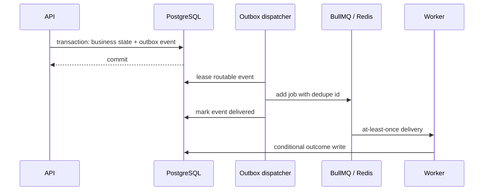

# Redis, queue, and outbox

Redis holds disposable coordination state: BullMQ data, rate-limit windows, and
health probes. PostgreSQL remains authoritative for accepted work and outcomes.
The deployed Redis service uses AOF and `noeviction`.

Request-facing Redis clients have bounded connect/command timeouts and finite
retries. BullMQ's blocking worker connections retry as required by the queue.
An unavailable queue delays dispatch; it does not invalidate committed work.

## Outbox delivery

The dispatcher claims only event types registered by the current worker, under
a PostgreSQL lease and fencing claim. It marks an event delivered after queue
publication succeeds. A crash between publish and settlement can publish the
same event again; consumers therefore make duplicate and stale deliveries
no-ops with database constraints and compare-and-set writes.

Transient or unknown publish failures are rescheduled with capped backoff.
Payloads that BullMQ cannot serialize or accept are parked as failed because a
retry cannot change them. Failed rows are retained for investigation.

Current routes include agent execution, knowledge embedding, and approved tool
side effects. Queue payloads contain durable identifiers, never credentials,
prompts, full configuration, or executable authority.

## Agent execution

BullMQ's active-start ordinal is stored as the run attempt fence. Claims only
move forward; terminal writes must match the exact claimed ordinal. A worker
that resumes after losing ownership cannot finalize a run now owned by another
delivery.

Retryable execution failures consume the configured BullMQ budget.
Deterministic application configuration failures are finalized immediately.
Model calls and read-only tools can execute more than once if a process dies
before recording success; callers must not treat them as exactly once.

The worker reconciles old non-terminal runs against terminal BullMQ failures
because the transport can fail a stalled job without invoking application code.
It conditionally records a safe failure only when the job is provably failed.
A missing job is not proof of failure. MCP sessions have no queue job and expire
by their absolute session lifetime instead.

## Approved side effects

Approval, the tool-execution transition, the audit record, and the outbox event
commit together. The side-effect worker rechecks organization state, approval
digest, grants, and recipient membership immediately before calling the
provider. It claims attempts with compare-and-set and sends a provider
idempotency key derived from the execution ID.

An ambiguous provider outcome is recorded as `OUTCOME_UNKNOWN`, not retried as
a known failure. Providers without request-level idempotency cannot perform the
effect. If a process dies after the call and exhausts transport recovery before
settlement, an operator must reconcile the row against the provider; see the
[operations runbook](operations-runbook.md#approved-agent-actions-that-never-settled).

Outbox retention and exported backlog metrics are not currently implemented.
