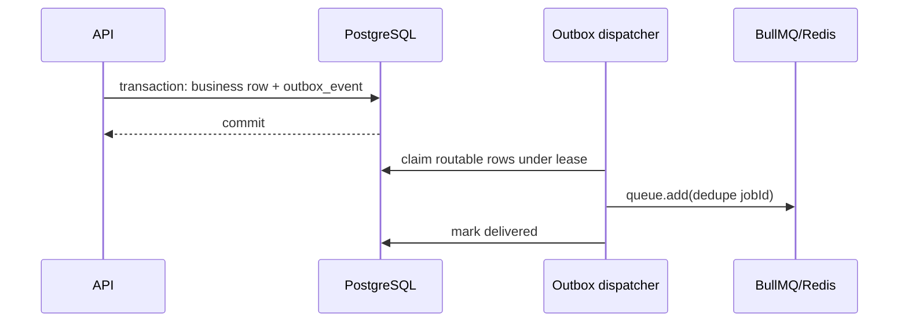

# Redis, queue, and outbox

Redis holds coordination state: BullMQ, sliding-window rate limits, probes, and
future short-lived coordination. Production enables AOF with `noeviction`, but
Redis is never the system of record.

Connections are provisioned by role. Request-facing/general commands have
bounded timeouts, finite retries, and no offline queue. Queue producers return
after bounded failure so outbox work remains claimable. Worker blocking
connections retry indefinitely as BullMQ requires.

A crash between publish and mark-delivered produces a duplicate after lease
expiry. Consumers must therefore be idempotent through PostgreSQL constraints;
BullMQ job IDs are only an optimization. Unknown publish failures retry with
capped backoff, while deterministically invalid payloads are parked and kept.
Known gaps in the current application are outbox retention and exported backlog
metrics.

The internal AgentRun acceptance boundary follows that existing path: one
PostgreSQL transaction creates a `QUEUED` `agent_run` and an
`agent-run.queued` outbox event whose payload is only `{ runId }` and whose
dedupe key is that run id. The existing route publishes `execute` to
`agent-execution`. `WorkerModule` explicitly registers the single
`AgentExecutionHandler`; `QueueModule` contains publication only, so the API
composition root cannot consume jobs.

The handler stores BullMQ's `attemptsStarted` active-start ordinal as the durable
AgentRun `attemptCount` compare-and-set version. Unlike `attemptsMade`, that
ordinal advances for stalled-job recovery as well as ordinary retries.

The claim is **monotonic, not exact-predecessor**: a delivery takes ownership
when `attemptCount < attemptsStarted`, and equal or lesser ordinals are stale
or duplicate and do nothing. This matters because BullMQ increments
`attemptsStarted` in Redis at move-to-active, before application code runs, so
a worker killed between activation and its first write consumes an ordinal
PostgreSQL never sees. The durable sequence is strictly increasing but may have
gaps — after a claim at 1, the next delivery to arrive can legitimately be 3.
Requiring an exact predecessor would wedge that run permanently. The ordinal is
used as a fencing token, which is sound because BullMQ never reissues or
decrements it; completion and failure writes are still gated on the exact
`attemptCount` the caller claimed, so a superseded worker cannot finalize a run
another delivery now owns.

Terminal runs are no-ops. Retryable failures stay `RUNNING` and reject for
BullMQ retry; the configured final attempt records `FAILED` and also rejects so
BullMQ job state remains truthful. Outbox delivery, BullMQ job, and AgentRun
lifecycle states remain distinct.

The worker resolves the definition by the persisted `(agentId, agentVersion)`
pair, never by id alone. A definition is immutable once published under a
version, and any version still referenced by a `QUEUED` or `RUNNING` AgentRun
must stay resolvable through a rolling deployment. Unknown pairs fail loudly
rather than falling back to a newer revision. Automated retention of
superseded versions is not implemented; the first real agent feature starts at
v1.

A process can call a model and die before recording `SUCCEEDED`; the later
attempt may call the model again. This is accepted for the current
model-only/read-only slice, not presented as exactly-once execution. Durable
tool-side-effect idempotency must be revisited before adding tools. There is
still no public AgentRun endpoint or production agent definition; the first
real agent feature will supply the authorized caller, definition, and provider
configuration.

If a job exceeds BullMQ's stalled-job allowance (`maxStalledCount`, default 1),
BullMQ records a deferred failure and fails the job on next pickup *without
invoking the handler again*, so the AgentRun can remain `RUNNING` forever with
no application code able to reconcile it. Terminal transport reconciliation is
intentionally deferred while production definitions are empty.

**Terminal BullMQ failure reconciliation is a hard prerequisite before enabling
the first production AgentDefinition or public AgentRun API.**
