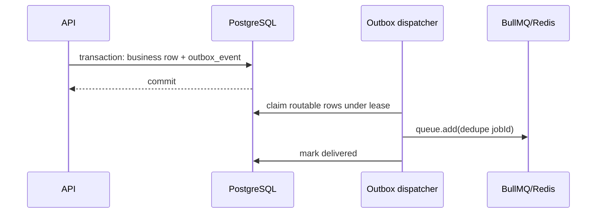

# Redis, queue, and outbox

Redis holds coordination state: BullMQ, sliding-window rate limits, probes, and
future short-lived coordination. Production enables AOF with `noeviction`, but
Redis is never the system of record.

Connections are provisioned by role. Request-facing/general commands have
bounded timeouts, finite retries, and no offline queue. Queue producers return
after bounded failure so outbox work remains claimable. Worker blocking
connections retry indefinitely as BullMQ requires.

A crash between publish and mark-delivered produces a duplicate after lease
expiry. Consumers must therefore be idempotent through PostgreSQL constraints;
BullMQ job IDs are only an optimization. Unknown publish failures retry with
capped backoff, while deterministically invalid payloads are parked and kept.
Known gaps in the current application are outbox retention and exported backlog
metrics.
