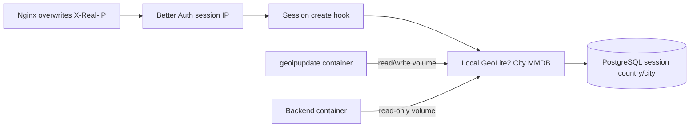

# GeoIP session location

Session location is approximate security context, not proof of a person's
physical location. The Backend derives it during Better Auth session creation
from the canonical session IP and stores nullable `country` and `city` fields.
The browser cannot write either field.



The lookup path never calls a remote geolocation service. The official
`@maxmind/geoip2-node` database reader watches the local MMDB for updater
changes. Missing files, invalid/private/loopback addresses, addresses without a
record, and reader exceptions all return `{ country: null, city: null }` and do
not block authentication. Failed database opens are retried at a bounded
interval.

`country` is normalized to an ISO 3166-1 alpha-2 code when present. `city` uses
the database's English city label and is capped at 255 characters. The Platform
shows both beside each active session's IP.

## Runtime prerequisites

The operator stores `GEOIPUPDATE_ACCOUNT_ID` and
`GEOIPUPDATE_LICENSE_KEY` only in `/etc/ai-agent/runtime.env`. The updater owns
write access to `geoip_data`; Backend mounts the same volume read-only at
`/usr/share/GeoIP`. `GEOIP_DATABASE_PATH` defaults to
`/usr/share/GeoIP/GeoLite2-City.mmdb`.

Operator verification after first deployment:

```bash
sudo docker compose --profile production logs geoipupdate
sudo test -s /var/lib/docker/volumes/ai-agent_geoip_data/_data/GeoLite2-City.mmdb
```

The second command is host-specific and may require resolving the actual Docker
volume mountpoint with `docker volume inspect`; do not expose the MaxMind
credentials while diagnosing it.
