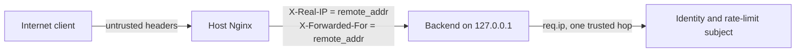

# Reverse proxy and real client IP

Host Nginx is the only public HTTP peer of the application containers. The
containers publish host ports on loopback, so a remote client cannot bypass the
proxy. Nginx then **overwrites** both client identity headers with
`$remote_addr`; it never appends an untrusted incoming chain.

The Express policy is derived from validated `NODE_ENV` configuration and has
no broad trust switch:

- `development` and `test`: zero trusted hops; direct forwarding headers are
  overwritten from the socket for Better Auth, which reads `x-real-ip`
  directly.
- `staging` and `production`: exactly one trusted hop. The host firewall and
  Compose loopback binding make that hop Nginx.

`req.ip` is the only application-level client IP. Application code must not
parse `X-Forwarded-For`. Better Auth 1.6.27 is explicitly configured with
`advanced.ipAddress.ipAddressHeaders = ['x-real-ip']` because its native routes
do not use Express `req.ip`.

The route template preserves `/api/` and `/platform/` prefixes when proxying.
TLS server blocks and installation are added with the Lightsail host bootstrap;
this PR owns the shared routing and identity-header snippets they consume.
